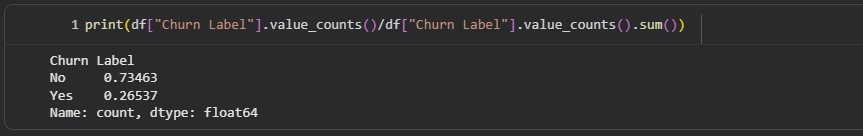
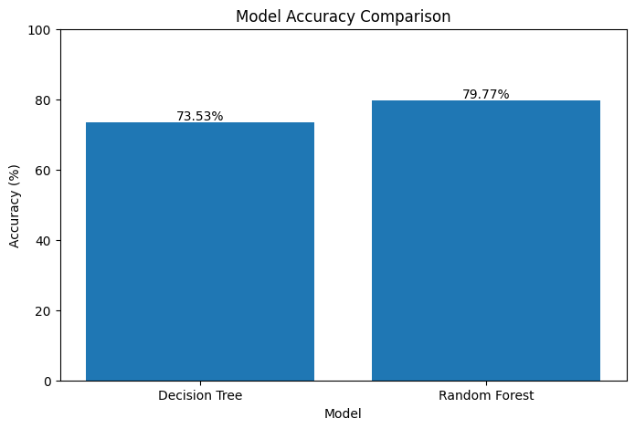
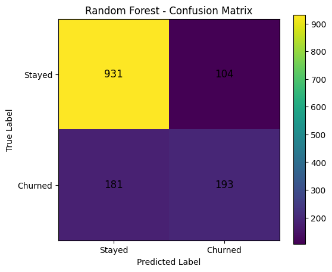

# 📊 Customer Churn Prediction Using Machine Learning

## 📌 Project Overview

This project focuses on predicting whether a telecom customer is likely to churn using Machine Learning techniques.

The project was completed as part of my internship at **SkillINFyTech IT Solutions Private Limited**.

The system analyzes customer demographics, service subscriptions, contract information, and billing details to predict whether a customer is likely to leave the telecom service.

The project follows an end-to-end Machine Learning workflow, including data exploration, preprocessing, feature encoding, handling class imbalance, model training, model evaluation, and prediction for new customers.

---

## 🎯 Project Objective

The main objective of this project is to develop a Machine Learning model that can predict whether a telecom customer is likely to churn based on historical customer information.

The project aims to:

- Analyze telecom customer churn data.
- Explore customer churn patterns through data visualization.
- Perform data preprocessing and feature selection.
- Convert and clean numerical and categorical features.
- Encode categorical variables for Machine Learning.
- Handle class imbalance in the target variable.
- Train and compare Decision Tree and Random Forest classifiers.
- Evaluate model performance using classification metrics and confusion matrices.
- Predict churn for new customers.
- Provide the probability of customer churn and staying.
- Save and load the trained Machine Learning model.

---

## 📂 Dataset

The dataset contains information about **7,043 telecom customers** and includes customer demographics, service subscriptions, contract details, billing information, and churn information.

The original dataset contains **33 columns**, from which relevant features were selected for Machine Learning.

### Dataset Information

- **Total Records:** 7,043
- **Original Features:** 33
- **Selected Predictive Features:** 24
- **Target Variable:** `Churn Label`

### Target Variable

The `Churn Label` was converted into a binary target variable:

- `0` → Customer Stayed
- `1` → Customer Churned

### Churn Distribution

- Customers Stayed: **5,174 (73.46%)**
- Customers Churned: **1,869 (26.54%)**

The dataset is imbalanced because the number of customers who stayed is significantly higher than the number of customers who churned.

---

## 📊 Exploratory Data Analysis

Exploratory Data Analysis (EDA) was performed to understand the dataset and analyze the distribution of customer churn.

The analysis included:

- Dataset shape and structure
- Data types
- Missing value analysis
- Duplicate row checking
- Churn distribution analysis
- Churn percentage analysis
- Identification of categorical and numerical features

### Churn Distribution

The churn distribution was visualized to understand the imbalance between customers who stayed and customers who churned.



---

## ⚙️ Data Preprocessing

The following preprocessing steps were performed:

### 1. Feature Selection

Relevant customer information was selected for model training.

The selected features included:

- Customer location
- Demographic information
- Customer tenure
- Phone services
- Internet services
- Online security and backup services
- Device protection
- Technical support
- Streaming services
- Contract information
- Paperless billing
- Payment method
- Monthly charges
- Total charges
- Customer Lifetime Value (CLTV)

### 2. Missing Value Handling

The dataset was checked for missing values.

The `Churn Reason` column contained missing values because churn reasons are only available for customers who actually churned. Since this column is not required for prediction, it was excluded from the model features.

### 3. Numerical Data Conversion

The `Total Charges` feature was originally stored as an object/string data type.

It was converted into a numerical format to make it suitable for Machine Learning.

### 4. Target Encoding

The `Churn Label` was converted into binary values:

```text
No  → 0
Yes → 1
```

### 5. Categorical Feature Encoding

Categorical variables were converted into numerical representations using **One-Hot Encoding**.

This allowed categorical customer information to be processed by the Machine Learning models.

### 6. Train-Test Split

The dataset was divided into:

- **80% Training Data:** 5,634 records
- **20% Testing Data:** 1,409 records

Stratified splitting was used to maintain a similar distribution of churned and non-churned customers in both training and testing datasets.

### 7. Handling Class Imbalance

The target variable was imbalanced, with approximately:

- 73.46% customers who stayed
- 26.54% customers who churned

To address this issue, the final Random Forest model used:

```python
class_weight="balanced"
```

An additional experiment was also performed using a higher weight for the churned class.

---

## 🤖 Machine Learning Models

Two primary Machine Learning classification models were trained and evaluated:

1. **Decision Tree Classifier**
2. **Random Forest Classifier**

An additional weighted Random Forest experiment was also performed to investigate the effect of different class weights on churn prediction.

---

## 🌳 Decision Tree Classifier

A Decision Tree Classifier was trained using the preprocessed customer data.

### Performance

- **Accuracy:** 73.53%
- **Churn Precision:** 50%
- **Churn Recall:** 74%
- **Churn F1-Score:** 0.60

The Decision Tree achieved relatively high recall for the churned class, meaning it identified a larger proportion of customers who actually churned.

However, its overall accuracy was lower than the Random Forest model.

---

## 🌲 Random Forest Classifier

A Random Forest Classifier was trained using multiple decision trees.

To address the class imbalance in the dataset, balanced class weights were used.

### Performance

- **Accuracy:** 79.77%
- **Churn Precision:** 65%
- **Churn Recall:** 52%
- **Churn F1-Score:** 0.58

The Random Forest achieved better overall accuracy compared with the Decision Tree.

---

## 🧪 Additional Class Imbalance Experiment

An additional Random Forest model was trained by assigning a higher weight to the churned class.

This experiment was performed to investigate whether increasing the importance of the minority class could improve the detection of customers likely to churn.

### Model Comparison

| Model | Accuracy | Churn Recall | Churn F1-Score |
|---|---:|---:|---:|
| Decision Tree | 73.53% | 74% | 0.60 |
| Random Forest (Balanced) | **79.77%** | 52% | 0.58 |
| Random Forest (Churn Weight = 2) | 79.49% | 51% | 0.57 |

The balanced Random Forest achieved the highest overall accuracy among the tested models and was selected as the final model.

---

## 🏆 Final Model Selection

The **Random Forest Classifier with balanced class weights** was selected as the final model.

### Final Model Performance

- **Accuracy:** 79.77%
- **Churn Precision:** 65%
- **Churn Recall:** 52%
- **Churn F1-Score:** 0.58

The Random Forest model was selected because it achieved the highest overall accuracy among the tested models.

Although the Decision Tree achieved a higher recall for the churned class, the Random Forest provided better overall predictive performance.

The use of balanced class weights also helped address the class imbalance present in the dataset.

---

## 📈 Model Comparison

The performance of the tested Machine Learning models is visualized below.



---

## 🔍 Confusion Matrix

A confusion matrix was used to evaluate the predictions of the final Random Forest model.

The confusion matrix helps identify:

- Correctly predicted customers who stayed.
- Incorrectly predicted customers who were expected to stay but churned.
- Incorrectly predicted customers who were expected to churn but stayed.
- Correctly predicted customers who churned.



---

## 👤 Custom Customer Prediction

The project includes a custom customer prediction system that accepts information about a new customer and predicts whether the customer is likely to churn.

The prediction system provides:

- Customer churn prediction
- Probability of staying
- Probability of churning

### Example Prediction

```text
Prediction: Customer Likely to Churn
Stay Probability: 26.50%
Churn Probability: 73.50%
```

This functionality demonstrates how the trained Machine Learning pipeline can be used to make predictions for individual customers.

---

## 💾 Model Saving and Loading

The final trained Random Forest model was saved using **Joblib**.

The model can be saved using:

```python
joblib.dump(
    random_forest_model,
    "customer_churn_model.pkl"
)
```

The saved model can later be loaded using:

```python
loaded_model = joblib.load(
    "customer_churn_model.pkl"
)
```

The trained `.pkl` model file is **not included in this GitHub repository**.

A `.gitignore` file is used to prevent trained model files from being accidentally uploaded.

The complete preprocessing and model training workflow is available in the Jupyter Notebook, allowing the Machine Learning pipeline to be reproduced.

---

## 🛠️ Technologies and Tools Used

- **Python**
- **Pandas**
- **NumPy**
- **Scikit-learn**
- **Matplotlib**
- **Joblib**
- **Google Colab**
- **Jupyter Notebook**

---

## 📌 Key Machine Learning Concepts Used

This project demonstrates practical knowledge of:

- Supervised Machine Learning
- Binary Classification
- Decision Tree Classification
- Random Forest Classification
- Feature Selection
- Data Preprocessing
- One-Hot Encoding
- Numerical Data Conversion
- Train-Test Splitting
- Stratified Sampling
- Class Imbalance Handling
- Classification Metrics
- Confusion Matrix
- Model Comparison
- Probability-Based Prediction
- Model Saving and Loading

---

## ⚠️ Limitations

- The final model achieved **79.77% overall accuracy**, but the recall for the churned class was **52%**.
- The model may miss some customers who actually churn.
- The model's performance may vary when applied to different telecom customer populations.
- The model relies on historical customer data and may not fully capture future changes in customer behavior.
- The current project does not include advanced hyperparameter optimization.
- The current model has not been deployed as a production application.
- The dataset may not represent all telecom customer populations or market conditions.

---

## 🔮 Future Improvements

Future versions of this project can include:

- Hyperparameter tuning using `GridSearchCV` or `RandomizedSearchCV`.
- Applying SMOTE and other advanced resampling techniques.
- Optimizing the prediction threshold to improve recall for the churned class.
- Testing advanced boosting algorithms such as XGBoost or LightGBM.
- Performing detailed feature importance analysis.
- Adding model explainability techniques such as SHAP.
- Developing an interactive Streamlit web application.
- Deploying the model for real-time customer churn prediction.
- Monitoring model performance after deployment.
- Retraining the model periodically using updated customer data.

---

## 📁 Project Structure

```text
customer-churn-prediction-ml/
│
├── Customer_Churn_Prediction.ipynb
├── README.md
├── requirements.txt
├── .gitignore
│
└── images/
    ├── churn_distribution.png
    ├── model_comparison.png
    └── confusion_matrix.png
```

---

## 🚀 How to Run the Project

### 1. Clone the Repository

```bash
git clone https://github.com/gitsd23/customer-churn-prediction-ml.git
```

### 2. Open the Project

Open the following notebook:

```text
Customer_Churn_Prediction.ipynb
```

The notebook can be run using:

- Google Colab
- Jupyter Notebook
- JupyterLab

### 3. Install Required Libraries

Install the required Python libraries using:

```bash
pip install -r requirements.txt
```

### 4. Load the Dataset

Open the notebook in Google Colab and upload the required telecom customer churn dataset when prompted.

### 5. Run the Notebook

Execute the notebook cells sequentially to:

- Load the dataset.
- Explore the customer data.
- Perform data preprocessing.
- Encode categorical features.
- Split the data into training and testing sets.
- Train the Decision Tree model.
- Train the Random Forest model.
- Evaluate model performance.
- Compare the trained models.
- Make predictions for new customers.
- Save and load the final trained model.

---

## 📚 Key Learnings

Through this project, I gained practical experience in:

- Exploratory Data Analysis
- Data preprocessing
- Feature selection
- Handling missing values
- Handling categorical variables
- One-Hot Encoding
- Handling imbalanced datasets
- Decision Tree classification
- Random Forest classification
- Model evaluation
- Classification reports
- Confusion matrix analysis
- Model comparison
- Customer churn prediction
- Probability-based predictions
- Model saving and loading
- Building an end-to-end Machine Learning pipeline

---

## 📝 Conclusion

This project successfully developed a Machine Learning-based customer churn prediction system using telecom customer data.

Decision Tree and Random Forest classification models were trained and evaluated. An additional weighted Random Forest experiment was also performed to study the effect of class imbalance.

The **Random Forest Classifier with balanced class weights** achieved the best overall accuracy of **79.77%** among the tested models and was selected as the final model.

The project also includes a custom customer prediction system that accepts new customer information and predicts whether the customer is likely to churn, along with the estimated probability of staying and churning.

The project provided practical experience in data preprocessing, feature encoding, imbalanced classification, tree-based Machine Learning algorithms, model evaluation, and building an end-to-end Machine Learning pipeline.

The current model provides a strong baseline for customer churn prediction, while future improvements can focus on increasing recall for the churned class, improving model explainability, and developing a deployable real-world application.

---

## 👨‍💻 Author

**Soumadip Das**
B.Tech (Artificial Intelligence & Machine Learning)

GitHub: *https://github.com/gitsd23*

LinkedIn: *https://www.linkedin.com/in/soumadip-das-23s09d06/*


---

## 📜 Internship

This project was completed as part of my internship at:

**SkillINFyTech IT Solutions Private Limited**

---
